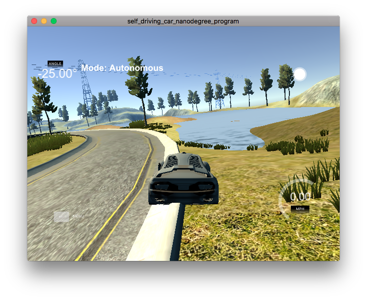
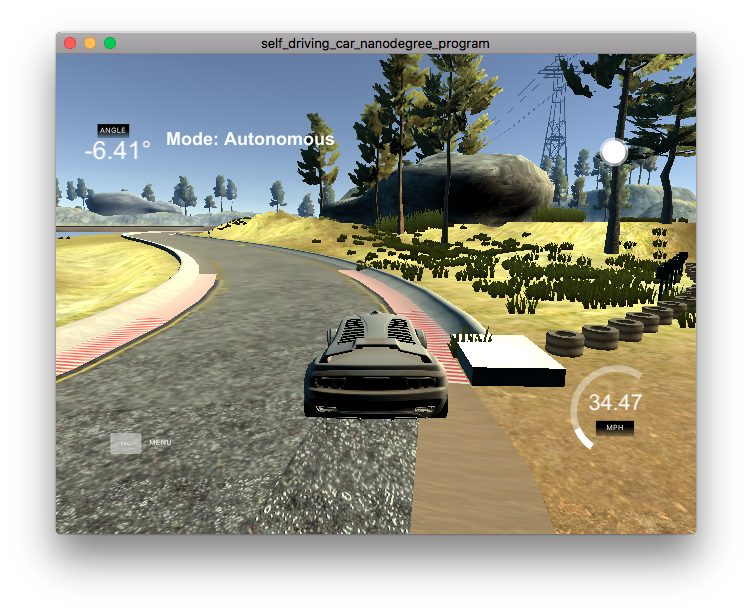
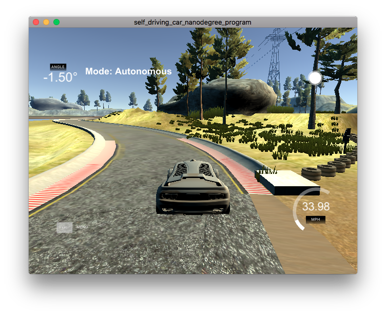

# CarND-PID-Control-Project

**PID Control Project**

In this project, I implement a PID controller in C++ to steer a car around a track in a simulator.

The goals / steps of this project are the following:

* Initialize the PID control coefficients in the PID object
* Implement the PID control algorithm to compute steering values
* Use the PID control algorithm to drive the car in the Udacity/Unity simulator
* Fine-tune the PID control coefficients until the car successfully drives around the track

#### How to run

1. Clone the project at https://github.com/bertcuda/CarND-PID-Control-Project.git

2. cd <project directory>/CarND-PID-Control-Project/build

3. ./pid

## [Rubric](https://review.udacity.com/#!/rubrics/824/view) Points

### Here I will consider the rubric points individually and describe how I addressed each point in my implementation.  

---

### Describe the effect each of the P, I, D components had in your implementation.

#### 1. Student describes the effect of the P, I, D component of the PID algorithm in their implementation. Is it what you expected?

The PID error components are:

p_error: the proportional component, or the distance between the expected position of the car and the actual position of the car in the lane.

i_error: the integral component, or the error accumulation over time that indicates a bias which makes the car tend to drive either right or left of the desired position in the lane.

d_error: the derivative component, or the rate of change of the error which is related to the changing curvature of the lane.

Each of these error components are multiplied by a coefficient which determines how significant the component is in the overall error calculation.

The coefficients (hyperparameters) are:

Kp: coefficient for the proportional error component
Ki: coefficient for the integral error component
Kd: coefficient for the derivative error component

### Describe how the final hyperparameters were chosen.

#### Student discusses how they chose the final hyperparameters (P, I, D coefficients). This could be have been done through manual tuning, twiddle, SGD, or something else, or a combination!

After using initial values of -0.5, 0, -0.5 for the Kp, Ki and Kd coefficients, I started by experimenting with different values to see if I could find a relationship between the Kp and Kd values. (I assumed that the car had no bias in the simulator and so left the Ki coefficient zero throughout.)

I tried using a larger value for Kd than Kp and the car began to oscillate left and right and left the track. Reversing the relationship and using a larger value for Kp than Kd I notices a more stable path for the car.

I then realized that the Kp value has a higher significance when the car is driving on the straight portions of the track, and through constant curves, and the Kd value has a higher significance when transitioning between straights and curves, and when curves are not constant.

This implies:

- the Kp value has to be relatively small to prevent overcorrection on straights and constant curves
- the Kd value has to be relatively much larger in order to correct the steering of the car when the lane curvature changes rapidly

### The vehicle must successfully drive a lap around the track.

#### No tire may leave the drivable portion of the track surface. The car may not pop up onto ledges or roll over any surfaces that would otherwise be considered unsafe (if humans were in the vehicle).

With this insight, I tried the following values and found the combination (Kp: -0.15, Ki: 0, Kd: -2.0) obtained the best result, keeping the car on the track and reaching a top speed of 35 mph.

- -0.1 0 -1.0
- -0.1 0 -1.1
- -0.1 0 -1.2
- -0.1 0 -1.4
- -0.1 0 -1.8
- -0.1 0 -2.0
- -0.15 0 -2.0
- -0.15 0 -2.0 Top speed of 35 mph
- -0.2 0 -2.0
- -0.25 0 -2.5
- -0.2 0 -2.5
- -0.2 0 -2.3

#### Initial coefficients (Kp: -0.5, Ki: 0, Kd: -0.5)

#### Better coefficients (Kp: -0.1, Ki: 0, Kd: -1.0)

#### Final coefficients (Kp: -0.15, Ki: 0, Kd: -2.0)

